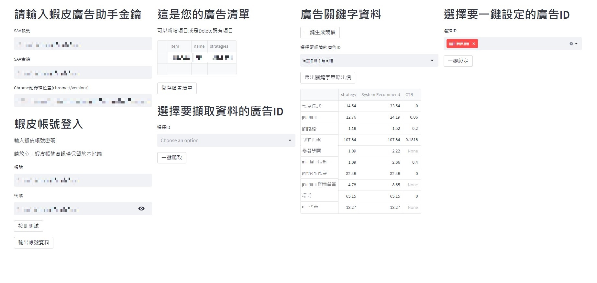

# Shopee Ads Assistant

ShopeeAdsAssistant 是一個用於在蝦皮平台上設置關鍵詞出價的工具。   
ShopeeAdsAssistant is a tool for setting keyword bids on the Shopee.    

## 使用方法 (Usage)
[點我看影片https://youtu.be/LoENj456vMM](https://youtu.be/LoENj456vMM)   
在開始使用前，您需要確保已經安裝了 Python3.10 (可以使用python-3.10.11-amd64.exe安裝)   
Before getting started, make sure you have Python3 and pip package manager installed. (You can use python-3.10.11-amd64.exe)

1. 直接點選`ui.bat`  
Directly click `ui.bat`  

## 注意事項 (Notes)

-   本工具僅適用於蝦皮平台的廣告管理。  
This tool is only suitable for Shopee advertising management.
    
-   請勿將您的賬號信息泄露給他人。  
Do not disclose your account information to others.

-   使用本工具所造成的後果由使用者自行承擔。  
The consequences of using this tool are borne by the user.   

## 授權許可 (License)
如有興趣，請加Line聯絡: @458qiqya   
Please contact me by Line: @458qiqya  
or email: ecoe.studio111@gmail.com
